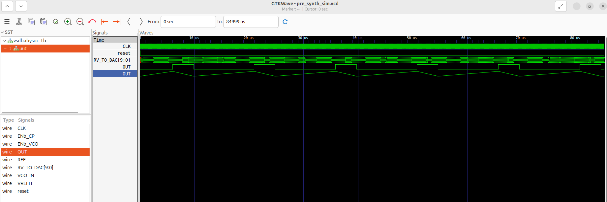

## VSDBabySoc functional flow - RTL to Gate Level Synthesis Flow

This repository walksthrough the full flow, from high-level RTL modeling to gate-level validation.

## 🔎 What’s Inside?

The BabySoC ties together three essential blocks:

- 🖥 rvmyth → a lightweight RISC-V CPU core

- 🎚 avsddac → Digital-to-Analog Converter (DAC)

- ⏱ avsdpll → Phase-Locked Loop (PLL)

These components form a minimal SoC that can be simulated, synthesized, and verified all the way down to the gate level.

## 🎯 Goals of the Project

- Build intuition in SoC architecture and flow

- Practice RTL modeling and verification with BabySoC

- Translate RTL into a SkyWater 130nm gate-level netlist

- Prove functional equivalence between RTL and GLS

## 🛠 Toolchain Overview

- We rely on a fully open-source stack:

- Sandpiper → Translates TL-Verilog into Verilog for rvmyth

- Icarus Verilog → RTL & GLS simulation

- Yosys → Logic synthesis with Sky130 library

- GTKWave → Waveform inspection

👉 To generate the CPU core Verilog:
```bash
pip3 install pyyaml click sandpiper-saas
sandpiper-saas -i ./src/module/*.tlv -o rvmyth.v --bestsv --noline -p verilog --outdir ./src/module/
```
##⚙️ Flow Walkthrough

## 1️⃣ Pre-Synthesis RTL Simulation
```bash
iverilog -o output/pre_synth_sim/pre_synth_sim.out -DPRE_SYNTH_SIM src/module/testbench.v -I src/include -I src/module
cd output/pre_synth_sim
./pre_synth_sim.out
gtkwave pre_synth_sim.vcd
```

✅ Confirms DAC writes and PLL locking at RTL level.


## 2️⃣ Synthesis with Yosys

Analog IPs (avsddac, avsdpll) are modeled as stubs (black boxes) during synthesis.

Example:
```verilog
module avsddac (
   output OUT,
   input [9:0] D,
   input VREFH,
   input VREFL
);
// Black-box definition
endmodule
```

Synthesis flow (Yosys):
```bash
read_liberty -lib src/lib/sky130_fd_sc_hd__tt_025C_1v80.lib
read_liberty -lib src/lib/avsddac.lib
read_liberty -lib src/lib/avsdpll.lib
read_verilog src/module/vsdbabysoc.v
read_verilog -I src/include src/module/rvmyth.v
read_verilog -I src/include src/module/clk_gate.v
read_verilog src/module/avsddac_stub.v
read_verilog src/module/avsdpll_stub.v
synth -top vsdbabysoc
dfflibmap -liberty src/lib/sky130_fd_sc_hd__tt_025C_1v80.lib
opt
abc -liberty src/lib/sky130_fd_sc_hd__tt_025C_1v80.lib
flatten
setundef -zero
clean -purge
rename -enumerate
write_verilog -noattr VSDBabySoC/src/module/vsdbabysoc_netlist.v
```

✅ Produces gate-level netlist and synthesis statistics.

## 3️⃣ Gate-Level Simulation (GLS)

Once synthesized, simulate the netlist to validate RTL equivalence:
``` bash
iverilog -DFUNCTIONAL -DUNIT_DELAY=#1 -I src/gls_model \
  -o output/post_synth_sim/post_synth_sim.out \
  src/module/testbench.rvmyth.post-routing.v src/module/testbench.v \
  src/gls_model/primitives.v src/gls_model/sky130_fd_sc_hd.v \
  output/synthesized/vsdbabysoc.synth.v src/module/avsdpll.v src/module/avsddac.v
```
```bash
cd output/post_synth_sim
./post_synth_sim.out
gtkwave dump.vcd
```

✅ GLS waveforms line up with RTL — functional equivalence achieved!

## 📊 Key Outcomes

- RTL simulation passed

- Netlist successfully synthesized

- GLS waveforms identical to RTL

## 🚀 Conclusion

The VSD BabySoC project provides a hands-on demonstration of a full-chip digital flow using open-source tools. By validating RTL and GLS consistency, the design is ready to move forward into physical design (PnR).
